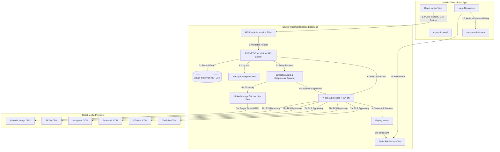
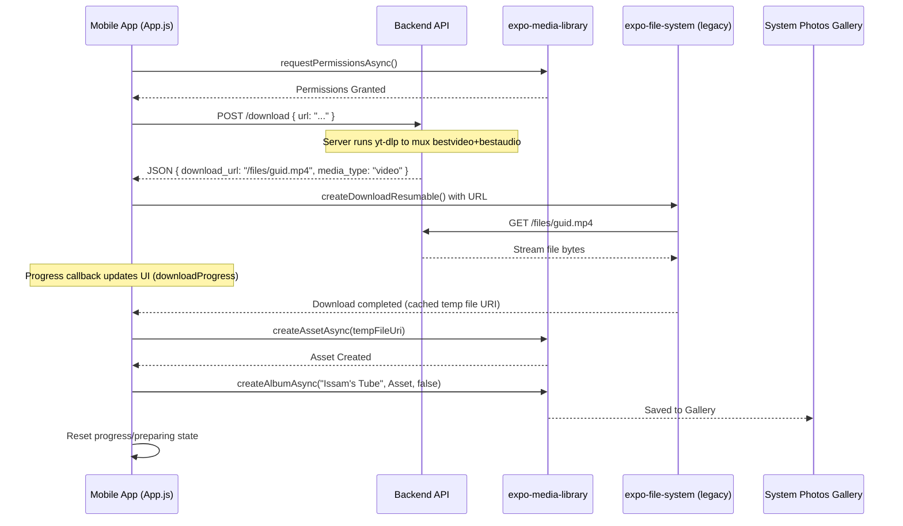

# Issam's Tube: Complete Architectural and System Documentation

Welcome to the comprehensive documentation for **Issam's Tube**—a private, self-hosted, full-stack video and image extraction platform. This document explains the system's design, file-by-file logic, API specs, frontend mechanics, test suites, and containerized deployment pipelines.

---

## 📖 Table of Contents
1. [Executive Summary & Purpose](#executive-summary--purpose)
2. [System Architecture](#system-architecture)
3. [Technology Stack](#technology-stack)
4. [Backend Deep-Dive (`backend/`)](#backend-deep-dive-backend)
    - [Subprocess & Command Runner (`YtDlpProcessRunner`)](#subprocess--command-runner-ytdlpprocessrunner)
    - [Extraction & Platform Routing (`ExtractionLogic`)](#extraction--platform-routing-extractionlogic)
    - [LinkedIn Fetcher (`LinkedInImageFetcher`)](#linkedin-fetcher-linkedinimagefetcher)
    - [API Setup & Database (`Program.cs`)](#api-setup--database-programcs)
5. [Mobile Frontend Deep-Dive (`app/`)](#mobile-frontend-deep-dive-app)
    - [App Lifecycle & Layout (`App.js`)](#app-lifecycle--layout-appjs)
    - [Media Library Integration](#media-library-integration)
    - [Network Architecture (LAN Setup)](#network-architecture-lan-setup)
6. [Testing Framework (`IssamsTube.Api.Tests/`)](#testing-framework-issamstubeapitests)
    - [Unit Testing (`ExtractionLogicTests.cs`)](#unit-testing-extractionlogictestscs)
    - [Integration Testing (`ExtractEndpointIntegrationTests.cs`)](#integration-testing-extractendpointintegrationtestscs)
7. [Infrastructure, CI/CD & Docker (`.github/workflows/`, `Dockerfile`, `docker-compose.yml`)](#infrastructure-cicd--docker-githubworkflows-dockerfile-docker-composeyml)
    - [Multi-stage Dockerfile](#multi-stage-dockerfile)
    - [Docker Compose Orchestration](#docker-compose-orchestration)
    - [GitHub Actions Workflows](#github-actions-workflows)
8. [Run Guide & Environment Configurations](#run-guide-and-environment-configurations)
9. [Operational Troubleshooting & Failure Classification](#operational-troubleshooting--failure-classification)

---

## 🎯 Executive Summary & Purpose

**Issam's Tube** is a custom utility engineered to extract, archive, and download media from social media networks including **TikTok**, **Instagram**, **Facebook**, **X/Twitter**, **YouTube**, and **LinkedIn**.

### Operational Constraints
- **Personal Archiving Utility**: The project is intentionally designed for personal usage, archiving content from followed accounts to locally owned physical hardware.
- **Subprocess-Based Abstraction**: The core engine acts as a wrapper around the open-source CLI media downloader `yt-dlp`. 
- **Non-Public Facing**: Security and infrastructure decisions (such as the exclusion of rate limiting, user registration, Terms-of-Service gates, and mobile app-store validation) reflect its single-tenant, personal nature.

---

## 🏗️ System Architecture

The following block diagram represents the execution pipeline of the system, starting from the mobile interface to CDN resolution:



### Flow Sequence
1. **Metadata Discovery (`/extract`)**:
   - The user inputs a target URL on the mobile UI.
   - The app dispatches a JSON body `{ "url": "..." }` with authorization headers.
   - The backend runs a fast CLI subprocess query (`yt-dlp -j --no-warnings ...`) to obtain raw platform JSON.
   - The API sanitizes headers (keeping `Referer` and `User-Agent` to bypass CDN hotlink protections) and returns JSON containing CDN URLs, thumbnails, and title strings.
2. **Local Server Download Muxing (`/download`)**:
   - The mobile client hits `/download`.
   - The server triggers `yt-dlp` to download the best audio and video streams separately, combining them locally on disk via `ffmpeg` into a single high-quality `.mp4` file.
   - The frontend downloads the local file from `/files/` and moves it to the phone's gallery.

---

## 🛠️ Technology Stack

| Layer | Technology | Details / Versions |
| :--- | :--- | :--- |
| **Backend Framework** | ASP.NET Core Minimal API | `.NET 9.0` |
| **Database ORM** | Entity Framework Core | `Microsoft.EntityFrameworkCore.Sqlite (9.0)` |
| **Media Downloader Core** | `yt-dlp` CLI Subprocess | Enabled with `curl-cffi` for TLS fingerprint spoofing |
| **Muxer & Post-Processor** | `ffmpeg` | Merges audio and video streams into standard MP4 containers |
| **Logging Service** | Serilog | Rolling file logging with daily rotation, structured stdout |
| **Mobile Client** | React Native (Expo) | Expo `~54.0.0`, React `19.1.0`, React Native `0.81.5` |
| **Networking & Gallery** | expo-file-system & expo-media-library | File caching and photo library exports |

---

## 💻 Backend Deep-Dive (`backend/`)

The backend codebase is written in C# targeting `.NET 9.0`. It is built as a single assembly containing minimal endpoint mappings, EF Core SQLite bindings, and CLI process routing.

### 1. Subprocess & Command Runner (`YtDlpProcessRunner`)
Defined in `backend/ExtractionLogic.cs`, this component handles executing external commands safely.

- **`RunAsync(string url, string? cookiesPath)`**: Used for fast metadata fetching.
  - Passes the `-j` flag (print JSON metadata to stdout without downloading the media content).
  - Explicitly adds YouTube formats optimization (`best[ext=mp4]/best`) to prevent pulling excessive format records.
- **`DownloadAsync(string url, string? cookiesPath, string outputPath)`**: Used for server-side downloading.
  - Requests the high-fidelity streams (`bestvideo+bestaudio/best`).
  - Sets the `--merge-output-format mp4` parameters to invoke `ffmpeg` to mux separate audio and video tracks without transcoding loss.
  - Outputs to a temporary GUID filename in the static files directory.
- **Base Process Configuration (`BasePsi()`)**:
  - `RedirectStandardOutput = true`, `RedirectStandardError = true` (to capture metadata/errors).
  - `--no-warnings` suppresses extra outputs that might corrupt JSON parse attempts.
  - `--socket-timeout 15` prevents hanging connection states.
- **Execution & Timeout Handling**:
  - Leverages `process.WaitForExitAsync()` with cooperative tokens.
  - Metadata requests time out at **30 seconds**; high-quality merges time out at **10 minutes**.
  - If a timeout is triggered, it kills the entire process tree using `process.Kill(entireProcessTree: true)` to clean up spawned shell threads.

### 2. Extraction & Platform Routing (`ExtractionLogic`)
The central orchestrator that guides requests based on URL patterns.

- **Platform Detection**:
  - Inspects the URI domain host to determine the specific platform (TikTok, Instagram, Facebook, X/Twitter, YouTube, LinkedIn).
- **LinkedIn Logic Routing**:
  - LinkedIn is treated differently because its text/image posts are not natively supported by `yt-dlp` in a way that yields clean direct URLs. If detected, it bypasses `yt-dlp` and sends the URL directly to the `LinkedInImageFetcher`.
- **Instagram Cookies Handling**:
  - Checks if a `cookies.txt` file exists inside `/app/cookies.txt` or a path defined by the environment variable `INSTAGRAM_COOKIES_PATH`. If present, it injects `--cookies <path>` into the command line to authenticate/bypass Instagram's page blocks.
- **Fallback Extraction Format Logic**:
  - Reads the returned stdout JSON. If the top-level URL properties are empty, it searches the `formats` array to extract the last element (which typically represents the highest bandwidth stream).
- **HTTP Headers Propagation**:
  - Filters out headers returned from `yt-dlp` and preserves only `Referer` and `User-Agent`. These are sent back to the mobile client so it can pass them when streaming or downloading directly from external CDNs.

### 3. LinkedIn Fetcher (`LinkedInImageFetcher`)
Defined in `backend/LinkedInImageFetcher.cs`.

- LinkedIn blocks standard system requests without proper browser headers. This service uses an `HttpClient` with a spoofed modern Chrome User-Agent header.
- Fetches the HTML source and uses Regular Expressions to look for `og:image` and `og:title` OpenGraph meta tags:
  ```csharp
  var pattern = $"<meta[^>]*property=[\"']og:image[\"'][^>]*content=[\"']([^\"']+)[\"']";
  ```
- It handles attribute order variations (e.g., `content` preceding `property`) by attempting a secondary match.

### 4. API Setup & Database (`Program.cs`)
Defined in `backend/Program.cs`.

- **Dependency Injection**:
  - Registers database context `AppDbContext` pointing to SQLite.
  - Registers `YtDlpProcessRunner` as a singleton.
  - Registers `LinkedInImageFetcher` with an HTTP Client factory.
- **Database Schema**:
  - Stores data using EF Core with SQLite. On start, `db.Database.EnsureCreated()` makes sure the table exists:
    ```csharp
    class DownloadHistory {
        public int Id { get; set; }
        public string Url { get; set; } = "";
        public string Platform { get; set; } = "";
        public string? Title { get; set; }
        public string? Thumbnail { get; set; }
        public DateTime Timestamp { get; set; }
        public bool Success { get; set; }
    }
    ```
- **API Key Security Middleware**:
  - An inline middleware intercepts incoming HTTP requests. If the host environment defines `API_KEY`, it mandates the presence of the `X-Api-Key` HTTP header. Invalid requests get a `401 Unauthorized` response. Swagger endpoints are exempted to enable testing.
- **Rolling Log Engine**:
  - Configures Serilog to stream logs to stdout and write files to `logs/issamstube-YYYYMMDD.log`.
- **Disk Housekeeping**:
  - The `/download` endpoint runs a quick disk cleaning routine before starting a download. It sweeps the local `/downloads` folder and deletes files older than **1 hour** to keep disk usage under control:
    ```csharp
    foreach (var file in Directory.GetFiles(downloadsDir)) {
        if (DateTime.UtcNow - File.GetCreationTimeUtc(file) > TimeSpan.FromHours(1)) {
            try { File.Delete(file); } catch { }
        }
    }
    ```

---

## 📱 Mobile Frontend Deep-Dive (`app/`)

The mobile client is built using React Native and Expo (v54) to run as an Android and iOS application.

### 1. App Lifecycle & Layout (`App.js`)
Defined in `app/App.js`.

- **State Management**:
  - `url`: Stores the user's input URL.
  - `loading`: Tracks loading state during metadata extraction.
  - `result`: Holds the metadata response (`video_url`, `title`, `thumbnail`, `media_type`, `headers`).
  - `downloading` & `downloadProgress`: Track downloading state and progress percentage.
  - `preparing`: Tracks state when the server is downloading and muxing video streams.
  - `screen`: Toggles between the `home` input screen and the extraction `history` feed.
- **Views**:
  - **Home Screen**: Paste and input components, extraction preview cards, action buttons.
  - **History Screen**: A `FlatList` displaying the history entries from `/history`.

### 2. Media Library & Download Sequence
The download flow handles fetching files and saving them to the device's native album:



> [!NOTE]
> The app imports `expo-file-system/legacy` to avoid file-writing issues on certain Android platforms with standard resumable streams in Expo v54.

### 3. Network Configuration
- **LAN Routing**: During local development, the phone connects to the host machine's IP (e.g., `http://192.168.11.133:8080`) rather than `localhost` or `127.0.0.1`, which point to the phone's loopback interface instead of the host machine.
- **Dynamic Key Routing**: The client automatically appends the `X-Api-Key` headers to outgoing calls if configured with a token.

---

## 🧪 Testing Framework (`IssamsTube.Api.Tests/`)

The solution includes automated unit and integration tests built using **xUnit** and **Moq**.

### 1. Unit Testing (`ExtractionLogicTests.cs`)
Covers the core methods in `ExtractionLogic` to verify correct behavior without running the real `yt-dlp` executable:

- **`InvalidUrl_ReturnsBadRequest_WithoutCallingRunner`**: Asserts that invalid or malformed strings return an error early, bypassing process execution.
- **`SuccessfulExtraction_UsesTopLevelUrl`**: Mock returns a raw JSON stdout containing a top-level `url` field, validating that it matches properly.
- **`SuccessfulExtraction_FallsBackToFormatsArray`**: Validates that if the top-level URL is missing, the code extracts the highest-quality stream URL from the `formats` array.
- **`NonZeroExit_PrivateMessage_ClassifiesAsVideoPrivate`**: Simulates a private video failure (stderr: `ERROR: This video is private`), asserting that it maps to the correct `VIDEO_PRIVATE` code.
- **`InstagramUrl_PassesCookiesPath_WhenFileExists`**: Verifies that the Instagram cookies injection logic passes the correct path parameter to the subprocess if the file exists.
- **`DetectPlatform_MatchesExpectedPlatform`**: Validates the routing parser logic across various domains (TikTok, Instagram, Facebook, X, etc.).
- **`ClassifyError_MatchesExpectedCode`**: Tests the regex matching engine in `ClassifyError` against known error messages.
- **`LinkedInUrl_ReturnsImageFromFetcher_WithoutCallingYtDlp`**: Asserts that LinkedIn links trigger the regex HTML parser instead of running `yt-dlp`.

### 2. Integration Testing (`ExtractEndpointIntegrationTests.cs`)
Runs integration tests using `Microsoft.AspNetCore.Mvc.Testing` to spin up an in-memory instance of the API:

- **`Extract_InvalidUrl_Returns400`**: Validates that sending an invalid URL to the `/extract` route returns a `400 Bad Request` status.
- **`Extract_KnownStableVideo_Returns200`**: Runs a live integration test against a stable X/Twitter video link to verify the complete connection loop, metadata extraction, and response parsing.

---

## 🚢 Infrastructure, CI/CD & Docker

The app uses containerization for deployment, making it easy to run on self-hosted hardware.

### 1. Multi-Stage Dockerfile (`backend/Dockerfile`)
The backend is packaged using a multi-stage Docker build to keep the runtime image size small:

- **Build Stage**:
  - Inherits from `mcr.microsoft.com/dotnet/sdk:9.0`.
  - Restores project dependencies, copies code, and publishes compilation artifacts using `dotnet publish -c Release -o /app`.
- **Runtime Stage**:
  - Inherits from `mcr.microsoft.com/dotnet/aspnet:9.0`.
  - Installs runtime dependencies: `python3`, `python3-pip`, and `ffmpeg` (for muxing audio and video streams).
  - Installs the latest version of `yt-dlp` with TLS fingerprinting capabilities (`pip install "yt-dlp[default,curl-cffi]"`).
  - Configures environments: `ASPNETCORE_URLS=http://+:8080`, `DB_PATH`, and `LOG_PATH`.

### 2. Docker Compose Orchestration (`docker-compose.yml`)
Runs the containerized service:

```yaml
services:
  backend:
    image: ghcr.io/issam-hamlil/issams-tube-backend:latest
    ports:
      - "8080:8080"
    environment:
      - API_KEY=${API_KEY}
    volumes:
      - ./backend/cookies.txt:/app/cookies.txt:ro
      - ./backend/data:/app/data
      - ./backend/logs:/app/logs
    restart: unless-stopped
```

- Mounts the host's `./backend/cookies.txt` into the container to authenticate with platforms like Instagram.
- Mounts `./backend/data` to keep database records across container restarts.
- Mounts `./backend/logs` for file-system logs.

### 3. GitHub Actions Workflows (`.github/workflows/ci.yml`)
Automates building, testing, and publishing:

- **`build-and-test` Job**:
  - Triggers on pushes or pull requests to any branch.
  - Checks out the code, sets up .NET 9.x, restores dependencies, builds the solution, and runs unit tests (excluding tests tagged with `"Category=Integration"` to prevent dependency on external networks during build steps).
- **`docker` Job**:
  - Triggers only on pushes to the `main` branch after the test suite completes.
  - Logs into GitHub Container Registry (GHCR).
  - Builds the runtime image using the Dockerfile and pushes it to `ghcr.io/issam-hamlil/issams-tube-backend:latest`.

---

## 🚀 Run Guide & Environment Configurations

### Prerequisites
- **Backend Development**: [.NET 9 SDK](https://dotnet.microsoft.com/download), [Python 3](https://www.python.org/downloads/), [ffmpeg](https://ffmpeg.org/), and `yt-dlp` installed and added to your system's PATH.
- **Frontend Development**: [Node.js](https://nodejs.org/), [Expo CLI](https://docs.expo.dev/), and Android Studio (for emulator testing) or a physical device with Expo Go.

### Running the Backend Locally
From the `/backend` directory:
```powershell
# Set optional configurations
$env:API_KEY="my-secret-key"

# Run the API
dotnet run --urls "http://0.0.0.0:8080"
```

### Running the Mobile Client
From the `/app` directory:
1. Open `App.js` and update `API_BASE_URL` with your development computer's LAN IP address.
2. Start the dev server:
   ```bash
   npm install
   npx expo start
   ```
3. Scan the QR code with your device or launch the emulator to test the application.

### Running the Test Suite
From the root workspace:
```bash
# Run unit tests only
dotnet test IssamsTube.sln --filter "Category!=Integration"

# Run all tests (including integration tests targeting live endpoints)
dotnet test IssamsTube.sln
```

---

## 🛠️ Operational Troubleshooting & Failure Classification

If a request fails, the API categorizes the error based on `yt-dlp` console output:

| Error Code | Triggering Condition | Recommended Resolution |
| :--- | :--- | :--- |
| **`UNSUPPORTED_PLATFORM`** | Unsupported URL domain name. | Verify spelling; check if the URL format matches standard sharing URLs. |
| **`VIDEO_PRIVATE`** | Private account content or login-walled post. | Update the host container's `cookies.txt` file with active browser session cookies for the platform. |
| **`VIDEO_UNAVAILABLE`** | Post deleted or removed by the platform. | Open the link in a browser to confirm the content is still accessible. |
| **`NETWORK_ERROR`** | SSL handshake failures or connection blocks. | Verify the host machine's internet connection; check if the IP has been rate-limited or blocked by the target platform's CDN. |
| **`LINKEDIN_IMAGE_NOT_FOUND`** | Scraping failed or meta tags are missing. | Confirm the post contains an image. Verify if LinkedIn has changed its OpenGraph tag structure. |
